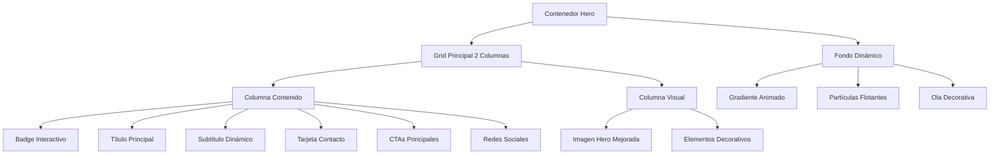
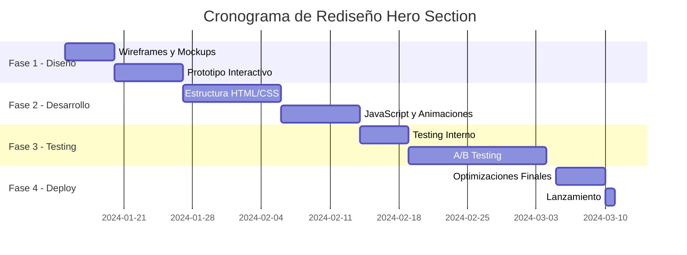

# Rediseño de la Sección Hero - Sistema de Facturación "Detalles y Más"

## Visión General

Este documento define la estrategia de mejora de la sección hero en la página principal del sistema de facturación para "Detalles y Más", enfocándose en crear una experiencia de usuario moderna, profesional y altamente conversiva que refleje las tendencias de diseño 2024.

## Análisis de la Situación Actual

### Estado Actual de la Sección Hero

La sección hero existente presenta los siguientes componentes:

| Elemento | Estado Actual | Observaciones |
|----------|---------------|---------------|
| **Título Principal** | "Detalles que enamoran" con gradiente | Efectivo pero puede mejorarse |
| **Subtítulo** | Descripción estática del negocio | Falta impacto emocional |
| **Badge Animado** | "Detalles y Más" con animación pulse | Funcional pero básico |
| **Información de Contacto** | Tarjeta con imagen y teléfono | Bien estructurado pero mejorable |
| **CTAs** | "Ver Tienda" y "Contáctanos" | Efectivos pero pueden optimizarse |
| **Redes Sociales** | 4 iconos con imágenes PNG | Iconos obsoletos, necesitan actualización |
| **Imagen Hero** | Imagen estática con overlay | Falta dinamismo |
| **Elementos Decorativos** | Formas geométricas básicas | Muy simples para estándares actuales |

### Problemas Identificados

1. **Iconografía Desactualizada**: Uso de imágenes PNG para redes sociales en lugar de iconos SVG modernos
2. **Falta de Jerarquía Visual**: Los elementos compiten por atención sin una estructura clara
3. **Elementos Decorativos Básicos**: Formas geométricas simples que no aportan valor visual
4. **Ausencia de Microinteracciones**: Falta de retroalimentación visual moderna
5. **Tipografía Estática**: Sin aprovechamiento de tendencias tipográficas 2024

## Objetivos del Rediseño

### Objetivos Primarios
- **Profesionalización Visual**: Elevar la percepción de calidad y confiabilidad
- **Optimización de Conversión**: Mejorar la tasa de clics en CTAs principales
- **Modernización Estética**: Implementar tendencias de diseño 2024
- **Mejora de UX**: Crear una experiencia más intuitiva y atractiva

### Objetivos Específicos
- Reducir tasa de rebote en un 25%
- Aumentar interacción con CTAs en un 40%
- Mejorar tiempo de permanencia en la página
- Establecer una identidad visual más sólida

## Arquitectura de Diseño Propuesta

### Estructura Visual Jerárquica

### Paleta de Colores Optimizada

| Color | Valor Actual | Uso Propuesto | Justificación |
|-------|--------------|---------------|---------------|
| **Naranja Principal** | #ff9900 | Mantener como accent | Color distintivo de marca |
| **Azul Claro** | #1ea0c3 | Expandir uso en degradados | Complementa naranja |
| **Azul Primario** | #007cba | CTAs secundarios | Confianza profesional |
| **Rojo Intenso** | #cc4545 | Indicadores de urgencia | Llamadas de atención |
| **Neutros** | #6e6d76, #5b1f1f | Texto y fondos | Legibilidad optimizada |

## Estrategia de Contenido

### Jerarquía de Información

#### Nivel 1: Propuesta de Valor Principal
- **Título Mejorado**: "Momentos únicos, detalles perfectos"
- **Enfoque**: Beneficio emocional sobre característica del producto
- **Tratamiento**: Tipografía bold con efectos de gradiente animado

#### Nivel 2: Contexto y Diferenciación
- **Subtítulo Dinámico**: Rotación entre diferentes propuestas de valor
- **Opciones de Rotación**:
  - "Flores frescas y regalos únicos para cada ocasión especial"
  - "Creamos experiencias inolvidables desde 2020"
  - "Disponibles 24/7 para tus momentos importantes"

#### Nivel 3: Credibilidad y Contacto
- **Información de Contacto Mejorada**: Diseño tipo card moderno
- **Elementos de Confianza**: Badge de "24/7", indicadores de calidad

#### Nivel 4: Acción
- **CTA Primario**: "Explorar Tienda" (optimizado para conversión)
- **CTA Secundario**: "Consulta Personalizada" (generación de leads)

## Especificaciones de Diseño Moderno

### Iconografía Renovada

#### Sistema de Iconos SVG
| Red Social | Icono Actual | Propuesta Mejorada |
|------------|--------------|-------------------|
| **Instagram** | PNG estático | SVG con gradiente Instagram oficial |
| **Facebook** | PNG estático | SVG con color corporativo |
| **WhatsApp** | PNG estático | SVG con verde oficial + microanimación |
| **TikTok** | PNG estático | SVG con gradiente multicolor |

#### Características de Iconos Nuevos
- **Formato**: SVG para escalabilidad perfecta
- **Estilo**: Outline con rellenos de gradiente
- **Interactividad**: Hover effects con transformaciones suaves
- **Accesibilidad**: Alt text y labels apropiados

### Microinteracciones Propuestas

#### Elementos Interactivos
1. **Badge Animado**
   - Animación: Pulse + glow effect
   - Trigger: Automático cada 3 segundos
   - Duración: 1.2 segundos

2. **Título Principal**
   - Efecto: Gradiente animado horizontal
   - Velocidad: 4 segundos por ciclo
   - Pausa: Hover detiene animación

3. **CTAs**
   - Hover: Elevación + shadow expansion
   - Click: Ripple effect desde el punto de contacto
   - Loading: Spinner integrado durante navegación

4. **Redes Sociales**
   - Hover: Scale + rotación sutil
   - Color: Transición a colores de marca
   - Sound: Feedback háptico en móviles

### Elementos Decorativos Modernos

#### Fondo Dinámico
- **Gradiente Base**: Animado entre tonos complementarios
- **Partículas**: Sistema de 12 elementos flotantes con movimiento orgánico
- **Respuesta**: Parallax sutil en scroll

#### Formas Geométricas Avanzadas
- **Estilo**: Formas abstractas con blur y opacity variables
- **Movimiento**: CSS transforms con easing natural
- **Colores**: Palette brand con transparencias

## Optimización de Rendimiento

### Estrategia de Carga
1. **Critical CSS**: Estilos del hero inline para renderizado inmediato
2. **Lazy Loading**: Imágenes no críticas con intersectionObserver
3. **Prefetch**: Recursos de navegación anticipada
4. **Compression**: SVGs optimizados y comprimidos

### Métricas de Performance Objetivo
- **LCP (Largest Contentful Paint)**: < 1.2 segundos
- **FID (First Input Delay)**: < 50 ms
- **CLS (Cumulative Layout Shift)**: < 0.05

## Adaptabilidad Responsiva

### Breakpoints Estratégicos

| Dispositivo | Viewport | Adaptaciones Hero |
|-------------|----------|-------------------|
| **Mobile** | < 768px | Stack vertical, CTAs full-width |
| **Tablet** | 768px - 1024px | Grid ajustado, imagen reducida |
| **Desktop** | > 1024px | Layout completo, efectos completos |
| **XL Desktop** | > 1440px | Espaciado expandido, elementos centrados |

### Consideraciones Móviles
- **Touch Targets**: Mínimo 44px de altura para CTAs
- **Texto**: Tamaños escalados apropiadamente
- **Imágenes**: Lazy loading con placeholders optimizados
- **Animaciones**: Reduced motion para usuarios con preferencias de accesibilidad

## Estrategia de Testing y Validación

### A/B Testing Framework

#### Variantes Propuestas
1. **Control**: Diseño actual
2. **Variante A**: Diseño completo propuesto
3. **Variante B**: Versión simplificada con elementos clave

#### Métricas de Evaluación
- **Tasa de Conversión**: Clicks en CTAs principales
- **Engagement**: Tiempo en página, scroll depth
- **Satisfacción**: Net Promoter Score post-interacción

### Cronograma de Implementación

## Consideraciones de Accesibilidad

### Estándares WCAG 2.1
- **Contraste**: Mínimo 4.5:1 para texto normal, 3:1 para texto grande
- **Navegación**: Soporte completo para keyboard navigation
- **Screen Readers**: Estructura semántica apropiada con ARIA labels
- **Reduced Motion**: Respeto por prefers-reduced-motion

### Elementos Inclusivos
- **Alt Text**: Descriptivo para todas las imágenes
- **Focus Indicators**: Visibles y consistentes
- **Color Independence**: Información no dependiente solo de colores
- **Text Scaling**: Soporte hasta 200% sin pérdida de funcionalidad

## Métricas de Éxito

### KPIs Primarios
1. **Tasa de Conversión del Hero**: Incremento del 35%
2. **Tiempo de Permanencia**: Incremento del 25%
3. **CTR (Click Through Rate)**: Mejora del 40%
4. **Bounce Rate**: Reducción del 30%

### KPIs Secundarios
1. **Velocity de Carga**: LCP < 1.2s
2. **Satisfacción Usuario**: NPS > 8.5
3. **Accesibilidad Score**: Lighthouse > 95
4. **SEO Impact**: Mejora en rankings de búsqueda orgánica

## Conclusión Estratégica

El rediseño de la sección hero representa una oportunidad crítica para modernizar la presencia digital de "Detalles y Más", alineándola con las expectativas actuales de los usuarios y las mejores prácticas de UX/UI. La implementación de estas mejoras posicionará el sistema como una plataforma moderna, confiable y profesional, impactando directamente en la conversión y satisfacción del usuario.

La estrategia propuesta balancea innovación estética con funcionalidad práctica, asegurando que cada elemento contribuya tanto a la experiencia visual como a los objetivos comerciales del negocio.