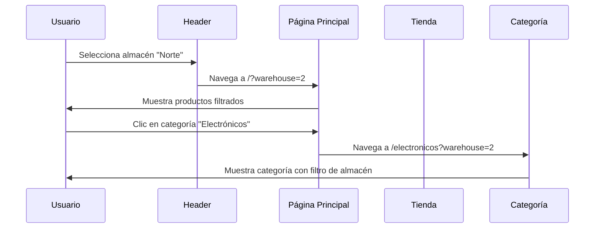

# Configuración de Ruta Principal - Sistema de Facturación

## Descripción General

El sistema actualmente redirecciona desde la raíz del dominio (`http://facturacion.test/`) hacia `/detalles`. El requerimiento es establecer que el contenido de `/detalles` se muestre directamente en la ruta raíz, eliminando la necesidad de la redirección y actualizando todas las referencias de navegación para mantener la coherencia del sistema.

## Contexto Actual

### Estructura de Rutas Existente

La aplicación Laravel utiliza las siguientes rutas principales:

| Ruta Actual | Controlador | Propósito |
|-------------|------------|-----------|
| `/` | Redirección → `/detalles` | Página de inicio |
| `/detalles` | `DetallesController@index` | Contenido principal de la tienda |
| `/detalles/contacto` | `DetallesController@submitContact` | Formulario de contacto |
| `/tienda` | `ShopController@index` | Catálogo de productos |
| `/carrito` | `CartController@index` | Carrito de compras |
| `/{categorySlug}` | `DetallesController@showCategory` | Páginas de categorías dinámicas |

### Arquitectura de Navegación

El sistema utiliza una estructura de navegación basada en:

- **Header Global**: Incluye enlaces a todas las secciones principales
- **Breadcrumbs**: Para navegación contextual en categorías
- **Enlaces de Retorno**: Para volver al inicio desde diferentes secciones
- **Carrito Persistente**: Accesible desde cualquier página

## Objetivos del Rediseño

### Objetivo Principal
Establecer la ruta raíz (`/`) para mostrar directamente el contenido que actualmente se encuentra en `/detalles`, mejorando la experiencia de usuario y la estructura de URLs.

### Objetivos Específicos

1. **Eliminación de Redirección**: Remover la redirección automática de `/` a `/detalles`
2. **Reasignación de Contenido**: Mover la funcionalidad de `DetallesController@index` a la ruta raíz
3. **Actualización de Referencias**: Modificar todos los enlaces que apuntan a `detalles.index` para usar la nueva ruta raíz
4. **Mantenimiento de SEO**: Preservar la funcionalidad de rutas dinámicas para categorías
5. **Coherencia de Navegación**: Asegurar que todos los elementos de navegación reflejen la nueva estructura

## Arquitectura de la Solución

### Estrategia de Implementación

La solución seguirá un enfoque de **reasignación progresiva** que garantice la funcionalidad continua del sistema durante la transición.

#### Flujo de Rutas Rediseñado

```mermaid
graph TD
    A[Usuario accede a /] --> B[DetallesController@index]
    B --> C[Vista index.blade.php]
    C --> D[Componentes principales]
    D --> E[Hero Section]
    D --> F[Productos Destacados]
    D --> G[Categorías]
    D --> H[Formulario Contacto]
    
    I[Enlaces de navegación] --> J[route('home')]
    K[Breadcrumbs] --> L[Inicio]
    M[Carrito] --> N[Mantiene funcionalidad]
    O[Categorías dinámicas] --> P[/{categorySlug}]
```

### Definición de Rutas Principal

| Nueva Ruta | Nombre de Ruta | Controlador | Propósito |
|------------|---------------|-------------|-----------|
| `/` | `home` | `DetallesController@index` | Página principal |
| `/contacto` | `contact.submit` | `DetallesController@submitContact` | Formulario de contacto |
| `/tienda` | `shop.index` | `ShopController@index` | Catálogo (sin cambios) |
| `/carrito` | `cart.index` | `CartController@index` | Carrito (sin cambios) |
| `/{categorySlug}` | `category.show` | `DetallesController@showCategory` | Categorías dinámicas |

### Mapeo de Actualizaciones de Referencias

#### Enlaces de Navegación a Actualizar

| Componente | Referencia Actual | Nueva Referencia |
|------------|------------------|------------------|
| **Header Principal** | `route('detalles.index')` | `route('home')` |
| **Logo** | `route('detalles.index')` | `route('home')` |
| **Breadcrumbs** | `route('detalles.index')` | `route('home')` |
| **Enlaces de Retorno** | `route('detalles.index')` | `route('home')` |
| **Formulario de Contacto** | `route('detalles.contacto.submit')` | `route('contact.submit')` |

#### Archivos de Vista Afectados

| Archivo | Cambios Requeridos |
|---------|-------------------|
| `partials/header.blade.php` | Actualizar enlaces de logo y navegación principal |
| `components/guest-layout.blade.php` | Modificar enlace "Volver al inicio" |
| `category.blade.php` | Actualizar breadcrumbs y botones de retorno |
| `cart/index.blade.php` | Modificar enlaces de "continuar comprando" |
| `shop/index.blade.php` | Actualizar referencias de navegación |
| `partials/hero.blade.php` | Verificar enlaces internos |

### Gestión de Estado y Parámetros

#### Preservación de Filtros Globales

El sistema actual utiliza parámetros de filtrado que deben preservarse:

| Parámetro | Descripción | Comportamiento Esperado |
|-----------|-------------|------------------------|
| `warehouse` | Filtro de almacén global | Mantener en todas las rutas |
| `category` | Filtro de categoría | Específico para tienda y categorías |
| Otros filtros | Marca, precio, etc. | Contextuales según la página |

#### Flujo de Navegación con Filtros



## Consideraciones Técnicas

### Compatibilidad de URLs Heredadas

Para mantener la compatibilidad con enlaces existentes y favoritos guardados:

#### Estrategia de Redirección

| URL Heredada | Acción | URL Destino |
|--------------|--------|-------------|
| `/detalles` | Redirección 301 | `/` |
| `/detalles?parametros` | Redirección 301 | `/?parametros` |
| `/detalles/contacto` | Redirección 301 | `/contacto` |

### Impacto en SEO

#### Medidas de Preservación

1. **Redirecciones 301**: Para transferir autoridad de página
2. **Actualización de Sitemap**: Reflejar la nueva estructura
3. **Meta Tags**: Verificar que no contengan referencias a `/detalles`
4. **Schema Markup**: Actualizar URLs canónicas

### Pruebas de Integración

#### Casos de Prueba Críticos

| Escenario | Verificación |
|-----------|--------------|
| **Acceso directo a raíz** | La página carga correctamente sin redirección |
| **Navegación desde header** | Todos los enlaces apuntan a las rutas correctas |
| **Formulario de contacto** | Se envía a la nueva ruta de contacto |
| **Filtros de almacén** | Se mantienen al navegar entre secciones |
| **URLs de categorías** | Funcionan correctamente con la nueva estructura |
| **Carrito de compras** | Los enlaces de retorno apuntan a la página principal |
| **Breadcrumbs** | Muestran "Inicio" como primera opción |

## Validación de Cambios

### Criterios de Aceptación

1. **Funcionalidad Principal**
   - La ruta raíz (`/`) muestra el contenido completo de la página principal
   - No existe redirección entre `/` y `/detalles`
   - Todos los formularios funcionan correctamente

2. **Navegación Coherente**
   - Todos los enlaces de "Inicio" dirigen a `/`
   - El logo de la empresa dirige a `/`
   - Los breadcrumbs muestran "Inicio" como raíz

3. **Preservación de Funcionalidad**
   - Los filtros de almacén se mantienen entre navegaciones
   - El carrito conserva su funcionalidad
   - Las categorías dinámicas siguen funcionando

4. **Compatibilidad Heredada**
   - Las URLs `/detalles` redirigen a `/`
   - Los parámetros se preservan en las redirecciones
   - No hay enlaces rotos en el sistema

### Métricas de Verificación

| Métrica | Objetivo | Método de Medición |
|---------|----------|-------------------|
| **Tiempo de Carga** | ≤ 2 segundos | Herramientas de performance |
| **Enlaces Rotos** | 0 | Validación automática |
| **Redirecciones Innecesarias** | 0 | Análisis de red |
| **Funcionalidad de Formularios** | 100% | Pruebas manuales |

## Beneficios Esperados

### Experiencia de Usuario
- **URLs más limpias**: Eliminación de `/detalles` en la navegación principal
- **Navegación intuitiva**: La ruta raíz muestra el contenido principal
- **Reducción de redirecciones**: Mejora en tiempos de carga inicial

### Optimización Técnica
- **SEO mejorado**: URLs más semánticamente correctas
- **Mantenimiento simplificado**: Menos complejidad en el enrutamiento
- **Performance**: Eliminación de redirecciones innecesarias

### Consistencia del Sistema
- **Estructura lógica**: La página principal en la ruta principal
- **Navegación predecible**: Comportamiento estándar esperado por usuarios
- **Escalabilidad**: Base sólida para futuras expansiones de funcionalidad