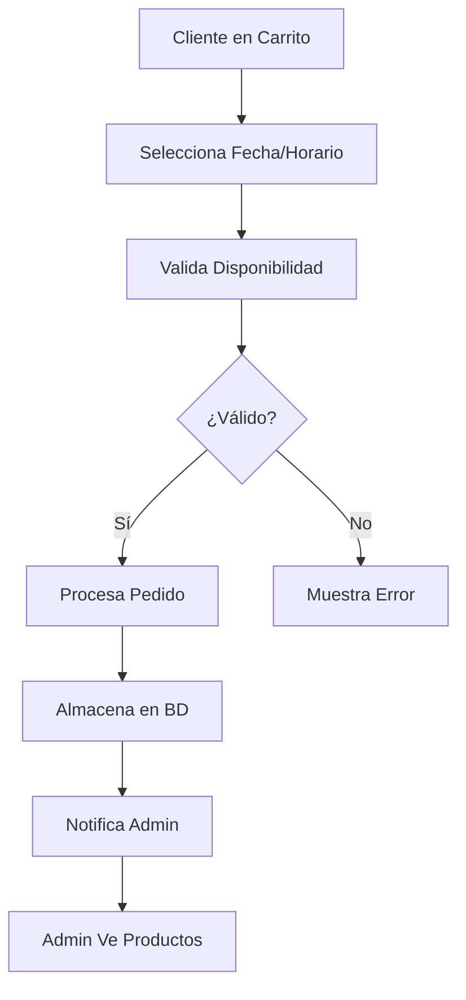
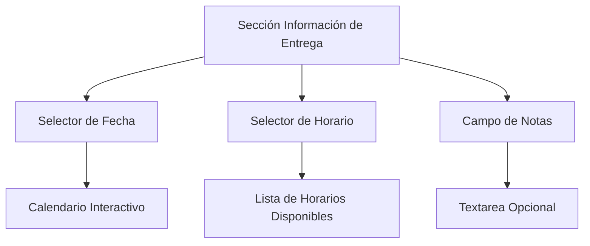
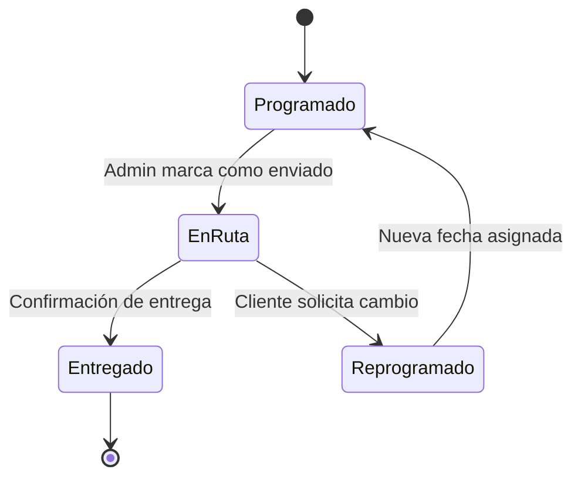
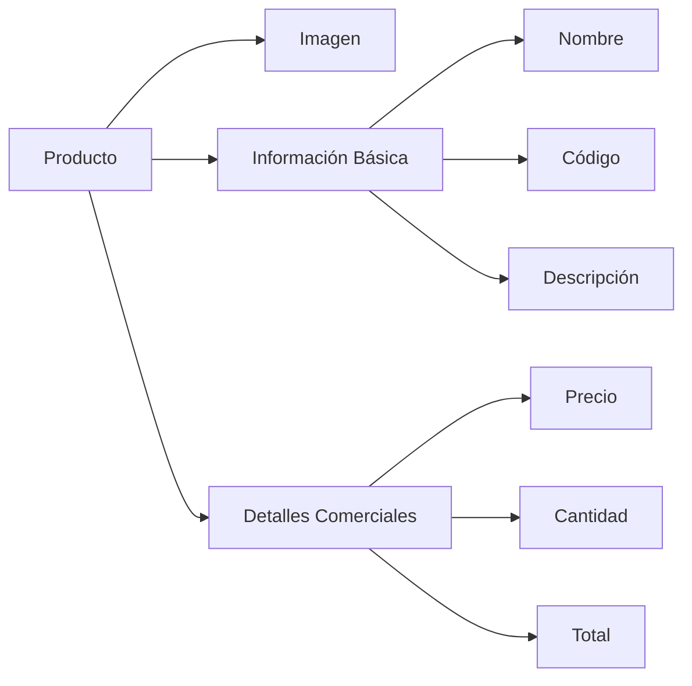

# Diseño: Nueva Funcionalidad de Carrito con Programación de Entregas

## Visión General

Esta funcionalidad extenderá el sistema de carrito de compras existente para incluir opciones de programación de entregas y mejorará la visualización de pedidos en el panel administrativo, permitiendo una mejor gestión del flujo de entrega y una experiencia de usuario más completa.

## Objetivos del Sistema

### Objetivo Principal
Permitir a los clientes programar sus entregas seleccionando fecha y horario específicos durante el proceso de checkout, y proporcionar a los administradores una vista detallada de los productos en cada pedido.

### Objetivos Específicos
- Permitir selección de fecha y horario de entrega en el carrito
- Almacenar información de programación de entregas
- Mostrar productos detallados en la administración de pedidos web
- Mantener compatibilidad con el sistema de facturación existente

## Arquitectura del Sistema

### Componentes Principales

| Componente | Responsabilidad | Ubicación |
|------------|----------------|-----------|
| **Formulario de Entrega** | Captura fecha y horario preferido | Vista Checkout |
| **Validador de Fechas** | Valida disponibilidad de fechas/horarios | Controlador |
| **Almacenador de Programación** | Persiste información de entrega | Modelo Invoice |
| **Visualizador de Productos** | Muestra detalles en admin | WebOrderResource |

### Flujo de Datos

## Modelo de Datos

### Extensión del Modelo Invoice

| Campo | Tipo | Descripción | Validación |
|-------|------|-------------|------------|
| `delivery_date` | Date | Fecha solicitada para entrega | Opcional, >= hoy |
| `delivery_time_slot` | String | Horario seleccionado | Enum de horarios |
| `delivery_notes` | Text | Notas específicas de entrega | Máximo 500 caracteres |

### Horarios de Entrega Disponibles

| Slot | Horario | Descripción |
|------|---------|-------------|
| `morning` | 9:00 - 12:00 | Mañana |
| `afternoon` | 14:00 - 17:00 | Tarde |
| `evening` | 18:00 - 20:00 | Noche |

## Interfaz de Usuario

### Sección de Programación en Checkout

#### Estructura Visual

#### Campos del Formulario

| Campo | Tipo | Requerido | Descripción |
|-------|------|-----------|-------------|
| `delivery_date` | Date Picker | Sí | Fecha deseada de entrega |
| `delivery_time_slot` | Radio Buttons | Sí | Horario preferido |
| `delivery_notes` | Textarea | No | Instrucciones especiales |

### Reglas de Validación

| Regla | Descripción | Mensaje de Error |
|-------|-------------|------------------|
| Fecha Mínima | Mínimo 1 día después de hoy | "La entrega debe programarse con al menos 1 día de anticipación" |
| Fecha Máxima | Máximo 30 días adelante | "Solo se pueden programar entregas hasta 30 días en el futuro" |
| Días Laborables | Solo lunes a sábado | "Las entregas solo están disponibles de lunes a sábado" |
| Horario Requerido | Debe seleccionar un horario | "Por favor selecciona un horario de entrega" |

## Administración de Pedidos

### Vista Detallada de Productos

#### Sección de Productos Ordenados

| Elemento | Información Mostrada |
|----------|---------------------|
| **Imagen del Producto** | Thumbnail 64x64px |
| **Nombre** | Nombre completo del producto |
| **Código** | Código del producto |
| **Cantidad** | Unidades solicitadas |
| **Precio Unitario** | Precio por unidad |
| **Subtotal** | Cantidad × Precio |

#### Información de Entrega en Admin

| Campo | Ubicación | Formato |
|-------|-----------|---------|
| Fecha Programada | Sección Entrega | DD/MM/YYYY |
| Horario | Sección Entrega | Descripción legible |
| Notas Especiales | Sección Entrega | Texto completo |

### Filtros Adicionales

| Filtro | Opciones | Propósito |
|--------|----------|-----------|
| **Por Fecha de Entrega** | Rango de fechas | Organizar entregas diarias |
| **Por Horario** | Mañana/Tarde/Noche | Agrupar por turnos |
| **Con Programación** | Sí/No | Separar pedidos programados |

## Estados y Flujos

### Estados de Entrega

| Estado | Descripción | Acciones Disponibles |
|--------|-------------|---------------------|
| `Programado` | Entrega planificada | Editar, Cancelar, Marcar en Ruta |
| `EnRuta` | En proceso de entrega | Confirmar Entrega, Reprogramar |
| `Entregado` | Completado exitosamente | Ver Historial |
| `Reprogramado` | Requiere nueva fecha | Asignar Nueva Fecha |

## Validaciones del Sistema

### Validaciones de Fecha

| Tipo | Regla | Implementación |
|------|-------|----------------|
| **Fecha Mínima** | >= Mañana | Carbon::tomorrow() |
| **Fecha Máxima** | <= 30 días | Carbon::now()->addDays(30) |
| **Días Válidos** | Lunes-Sábado | !Carbon::isWeekend() |
| **Días Festivos** | Excluir feriados | Configuración específica |

### Validaciones de Horario

| Horario | Disponibilidad | Restricciones |
|---------|----------------|---------------|
| Mañana (9-12) | Lun-Sáb | No domingos |
| Tarde (14-17) | Lun-Sáb | No domingos |
| Noche (18-20) | Lun-Vie | Solo días laborables |

## Notificaciones

### Para Clientes

| Evento | Tipo | Contenido |
|--------|------|-----------|
| Confirmación de Pedido | Email | Fecha y horario programados |
| Recordatorio de Entrega | SMS/Email | 1 día antes de la entrega |
| Cambio de Programación | Email | Nueva fecha/horario |

### Para Administradores

| Evento | Tipo | Contenido |
|--------|------|-----------|
| Nuevo Pedido Programado | Dashboard | Notificación en tiempo real |
| Entregas del Día | Email matutino | Lista de entregas programadas |
| Reprogramaciones | Notificación | Cambios solicitados por clientes |

## Mejoras en WebOrderResource

### Visualización de Productos

#### Tabla de Productos en Vista Detallada

| Columna | Ancho | Contenido |
|---------|-------|-----------|
| Imagen | 10% | Thumbnail del producto |
| Producto | 35% | Nombre y código |
| Cantidad | 15% | Unidades solicitadas |
| Precio Unit. | 20% | Precio individual |
| Subtotal | 20% | Total por producto |

#### Información Adicional por Producto

### Sección de Entrega en Formulario

| Campo | Tipo | Ubicación | Descripción |
|-------|------|-----------|-------------|
| Fecha Programada | Date Display | Sección Entrega | Solo lectura, editable |
| Horario | Select | Sección Entrega | Desplegable con opciones |
| Notas de Entrega | Textarea | Sección Entrega | Instrucciones especiales |
| Estado de Entrega | Badge | Header | Visual del estado actual |

## Consideraciones Técnicas

### Compatibilidad

| Aspecto | Consideración | Impacto |
|---------|---------------|---------|
| **Migraciones** | Campos nuevos opcionales | Sin ruptura de datos existentes |
| **APIs Existentes** | Mantener compatibilidad | Campos opcionales en respuestas |
| **Vistas** | Degradación elegante | Funciona sin programación |

### Rendimiento

| Componente | Optimización | Beneficio |
|------------|--------------|-----------|
| **Consultas** | Eager loading de productos | Reduce N+1 queries |
| **Caché** | Horarios disponibles | Mejora tiempo de respuesta |
| **Índices** | delivery_date, delivery_time_slot | Búsquedas más rápidas |

## Casos de Uso

### Caso de Uso 1: Cliente Programa Entrega

**Actor**: Cliente web
**Precondición**: Carrito con productos
**Flujo Principal**:
1. Cliente procede al checkout
2. Completa información personal
3. Selecciona fecha de entrega disponible
4. Elige horario preferido
5. Añade notas opcionales de entrega
6. Confirma el pedido
7. Recibe confirmación con detalles de entrega

### Caso de Uso 2: Admin Gestiona Pedidos Programados

**Actor**: Administrador
**Precondición**: Pedidos programados en sistema
**Flujo Principal**:
1. Admin accede a pedidos web
2. Filtra por fecha de entrega
3. Ve lista de productos por pedido
4. Actualiza estado de entrega
5. Notifica cambios al cliente

### Caso de Uso 3: Reprogramación de Entrega

**Actor**: Cliente/Admin
**Precondición**: Pedido con entrega programada
**Flujo Principal**:
1. Se solicita cambio de fecha/horario
2. Sistema valida nueva disponibilidad
3. Actualiza programación
4. Notifica a ambas partes
5. Actualiza estado en sistema

## Métricas y Monitoreo

### Indicadores de Éxito

| Métrica | Objetivo | Frecuencia |
|---------|----------|------------|
| **Tasa de Programación** | >70% de pedidos programados | Semanal |
| **Cumplimiento de Entregas** | >95% en horario programado | Diaria |
| **Satisfacción Cliente** | >4.5/5 en entregas programadas | Mensual |
| **Reprogramaciones** | <10% de pedidos | Semanal |

### Reportes Requeridos

| Reporte | Frecuencia | Destinatario |
|---------|------------|--------------|
| Entregas Diarias | Diario | Equipo de logística |
| Análisis de Horarios | Semanal | Gerencia |
| Satisfacción de Entrega | Mensual | Dirección |

## Seguridad

### Validaciones de Acceso

| Recurso | Validación | Restricción |
|---------|------------|-------------|
| **Programación** | Cliente autenticado o invitado | Solo su pedido |
| **Admin Pedidos** | Role administrativo | Todos los pedidos |
| **Cambio Estados** | Permisos específicos | Según nivel de usuario |

### Protección de Datos

| Dato | Nivel | Medida |
|------|-------|--------|
| **Info Personal** | Alto | Encriptación en BD |
| **Direcciones** | Medio | Acceso restringido |
| **Preferencias** | Bajo | Log de accesos |

## Casos Límite

### Gestión de Excepciones

| Escenario | Comportamiento | Solución |
|-----------|----------------|----------|
| **Fecha No Disponible** | Bloquear selección | Mostrar alternativas |
| **Capacidad Agotada** | Horario no disponible | Sugerir otros horarios |
| **Día Festivo** | Sin entregas | Calendario actualizado |
| **Emergencia** | Reprogramación masiva | Notificación automática |

## Fases de Implementación

### Fase 1: Funcionalidad Básica
- Campos de fecha y horario en checkout
- Almacenamiento en base de datos
- Validaciones básicas

### Fase 2: Administración Avanzada
- Vista de productos en pedidos
- Filtros por entrega
- Estados de entrega

### Fase 3: Optimizaciones
- Notificaciones automáticas
- Métricas y reportes
- Mejoras de UX