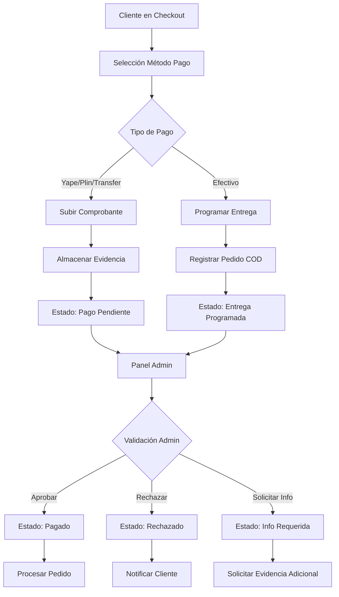
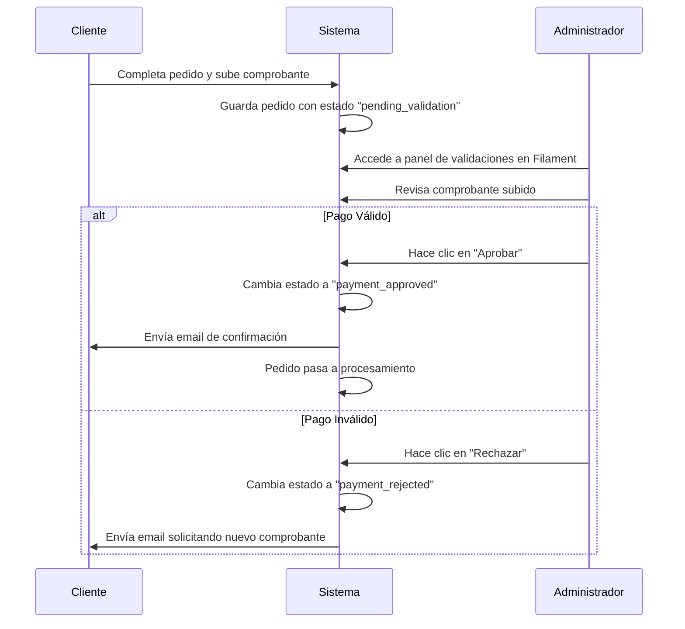
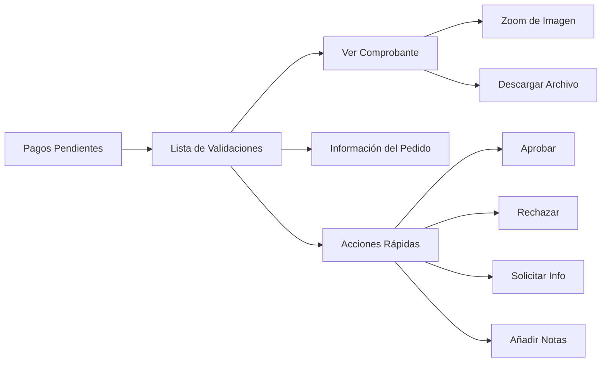

# Sistema de Gestión de Pagos Manuales - Fase 1 (MVP)

## Visión General

Implementación del módulo básico de gestión de pagos manuales para Yape, Plin, transferencias bancarias y efectivo contra entrega. Esta primera fase se enfoca en establecer la funcionalidad esencial para validar y procesar pagos de manera manual antes de integrar pasarelas automatizadas.

### Objetivo de la Fase 1
Establecer un sistema funcional básico que permita a los clientes reportar sus pagos y a los administradores validarlos de manera simple y eficiente.

### Alcance de la Fase 1
- Captura de comprobantes de pago en el checkout
- Estados básicos de validación de pagos
- Panel administrativo simple para aprobar/rechazar pagos
- Notificaciones básicas por email
- Integración con el flujo de pedidos existente

## Arquitectura Simplificada - Fase 1

### Componentes MVP

| Componente | Propósito | Implementación |
|-----------|-----------|----------------|
| **Captura de Comprobantes** | Campo para subir evidencia de pago en checkout | Formulario web con upload de archivos |
| **Validación Administrativa** | Lista simple de pagos pendientes en Filament | Resource de Filament con acciones básicas |
| **Estados de Pago** | Tres estados básicos: pendiente, aprobado, rechazado | Enum en modelo Invoice |
| **Notificaciones Email** | Confirmaciones básicas vía email | Mailable de Laravel |

## Estados de Pago Simplificados - Fase 1

### Estados Básicos del MVP

| Estado | Descripción | Acciones Disponibles |
|--------|-------------|---------------------|
| `pending_validation` | Pago reportado por cliente, esperando validación | Aprobar, Rechazar |
| `payment_approved` | Pago verificado y aprobado por administrador | Procesar pedido automáticamente |
| `payment_rejected` | Pago rechazado, requiere nuevo comprobante | Cliente debe reenviar evidencia |
| `cash_on_delivery` | Efectivo contra entrega programado | Confirmar entrega y pago |

### Flujo Simplificado - Fase 1

## Modelos de Datos

## Modelo de Datos - Fase 1

### Extensión Simple del Modelo Invoice

| Campo | Tipo | Descripción |
|-------|------|-------------|
| `payment_evidence_path` | string(nullable) | Ruta del comprobante subido |
| `payment_validation_status` | enum | pending_validation, payment_approved, payment_rejected |
| `payment_validated_at` | timestamp(nullable) | Fecha de validación |
| `payment_validated_by` | integer(nullable) | ID del admin que validó |
| `payment_operation_number` | string(nullable) | Número de operación reportado por cliente |
| `client_payment_phone` | string(nullable) | Teléfono usado para Yape/Plin |

## Interface de Usuario

## Interface de Usuario - Fase 1

### Modificaciones al Checkout Existente

#### Extensión de Métodos de Pago

**Para Yape/Plin:**
- Campo de archivo para subir screenshot
- Campo de texto para número de operación
- Campo opcional para teléfono
- Texto informativo con datos de la empresa

**Para Transferencia Bancaria:**
- Campo de archivo para subir comprobante
- Campo de texto para número de operación
- Información bancaria de la empresa

**Para Efectivo Contra Entrega:**
- Mantener funcionalidad actual
- Sin cambios adicionales en Fase 1

### Panel Administrativo

#### Dashboard de Pagos Pendientes

#### Vista de Validación Individual

| Sección | Contenido |
|---------|-----------|
| **Información del Pedido** | Cliente, monto, productos, fecha |
| **Detalles del Pago** | Método, referencia, notas del cliente |
| **Evidencia** | Visualizador de comprobante, metadatos |
| **Historial** | Timeline de acciones y cambios de estado |
| **Acciones** | Botones para aprobar, rechazar, solicitar info |
| **Notas Administrativas** | Campo para comentarios internos |

## Validaciones Básicas - Fase 1

### Validaciones del Frontend

| Validación | Implementación |
|------------|----------------|
| **Formato de Archivo** | Validación HTML: accept=".jpg,.jpeg,.png,.pdf" |
| **Tamaño de Archivo** | Máximo 2MB por archivo |
| **Campos Requeridos** | Archivo obligatorio para Yape/Plin/Transferencia |
| **Número de Operación** | Campo requerido para métodos digitales |

### Proceso Manual del Administrador

- Revisar visualmente el comprobante subido
- Verificar que el monto coincida con el pedido
- Confirmar que el número de operación sea válido
- Decisión simple: Aprobar o Rechazar

## Notificaciones Básicas - Fase 1

### Emails Automáticos al Cliente

| Evento | Contenido |
|--------|-----------||
| **Pedido Creado** | "Hemos recibido tu pedido y comprobante de pago. Lo validaremos pronto." |
| **Pago Aprobado** | "Tu pago ha sido aprobado. Procesaremos tu pedido." |
| **Pago Rechazado** | "Necesitamos que envíes un nuevo comprobante de pago." |

### Para el Administrador

- Indicador visual en Filament de pedidos pendientes
- Contador de validaciones pendientes en el dashboard

## Métricas Básicas - Fase 1

### Información Simple en Filament

| Widget | Contenido |
|--------|-----------||
| **Pagos Pendientes** | Contador de validaciones requeridas |
| **Pagos del Día** | Cantidad de pagos aprobados hoy |
| **Métodos Populares** | Gráfico simple de métodos más usados |

## Plan de Implementación - Solo Fase 1

### Tareas de Desarrollo

1. **Migración de Base de Datos**
   - Agregar campos necesarios a tabla `invoices`
   - Crear enum para estados de validación

2. **Modificar CheckoutController**
   - Agregar manejo de upload de archivos
   - Guardar campos adicionales de pago

3. **Actualizar Vista de Checkout**
   - Agregar campos de upload por método de pago
   - Mostrar información bancaria de la empresa

4. **Crear PaymentValidationResource en Filament**
   - Lista de pedidos pendientes
   - Acciones para aprobar/rechazar
   - Vista de comprobantes

5. **Implementar Mails Básicos**
   - PaymentReceivedMail
   - PaymentApprovedMail
   - PaymentRejectedMail

6. **Configurar Storage**
   - Directorio para comprobantes
   - Políticas de acceso seguro

## Consideraciones de Seguridad - Fase 1

### Protección Básica
- Comprobantes accesibles solo por administradores autenticados
- Validación de tipos de archivo permitidos
- Almacenamiento fuera del directorio público web
- Nombres de archivo aleatorios para evitar acceso directo

### Auditoría Simple
- Registro en logs de Laravel de acciones de validación
- Timestamps automáticos de cambios de estado
- Usuario responsable de cada validación

### Backup Básico
- Incluir directorio de comprobantes en backups regulares
- Resguardar registros de base de datos relacionados