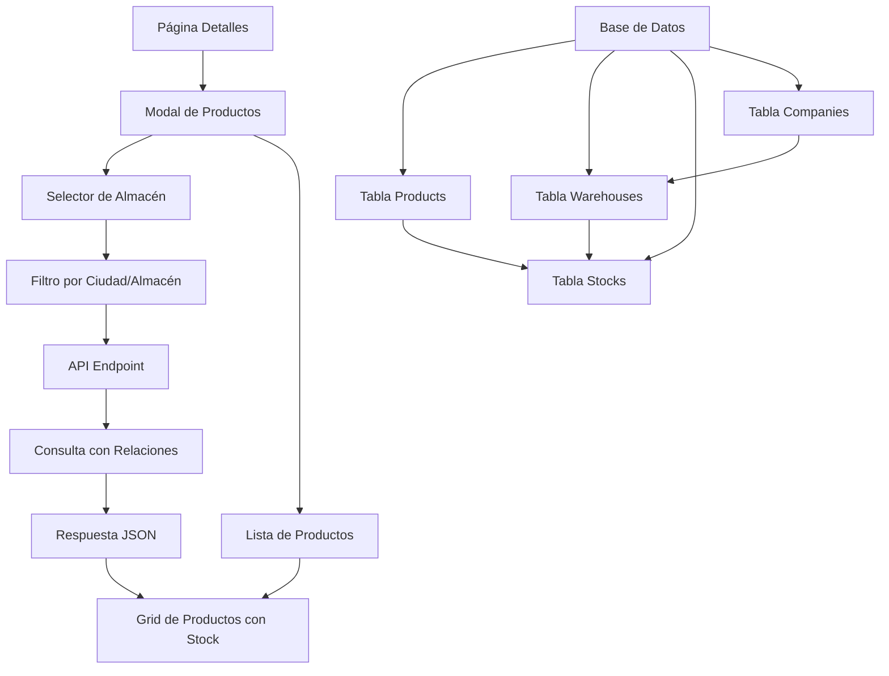
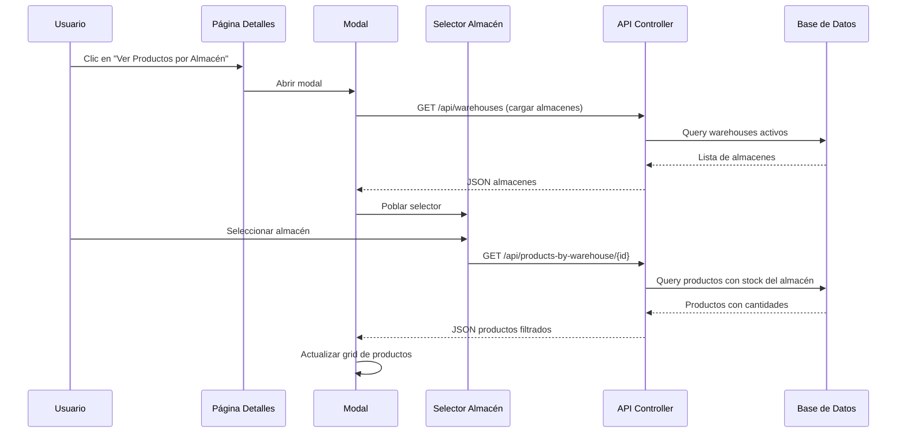
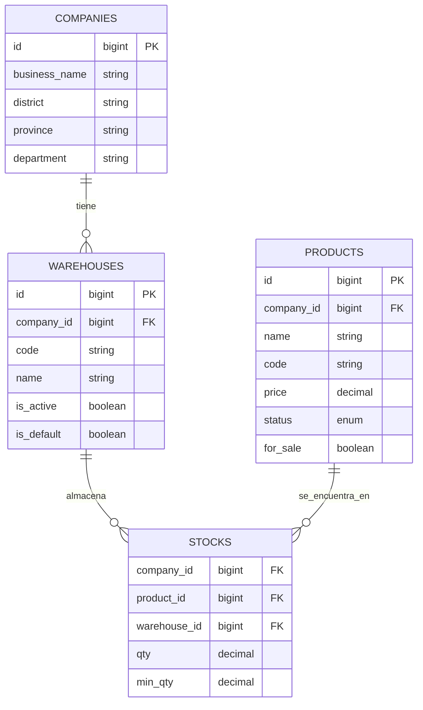
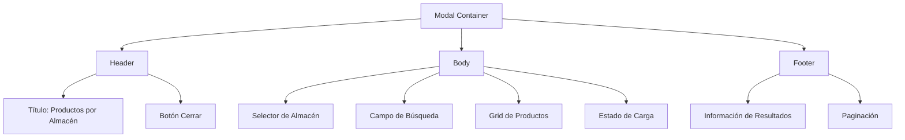
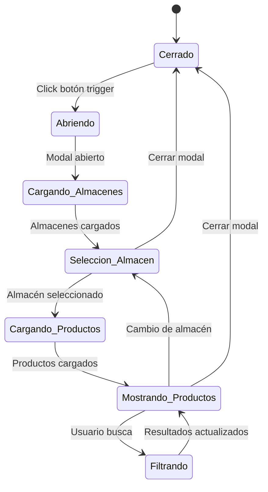

# Diseño: Modal de Productos por Ciudad/Almacén

## Resumen

Implementación de un modal interactivo en la página de detalles (`/detalles`) que permita filtrar y mostrar productos según el almacén seleccionado. El sistema aprovechará las relaciones existentes entre productos, stocks y almacenes para proporcionar una experiencia de usuario fluida y una gestión eficiente del inventario por ubicación.

## Arquitectura del Sistema

### Arquitectura General



### Componentes Principales

#### 1. Modal de Interfaz de Usuario
- **Propósito**: Contenedor principal que se superpone a la página de detalles
- **Comportamiento**: 
  - Apertura mediante botón trigger
  - Cierre por escape, overlay o botón close
  - Responsive design para dispositivos móviles
- **Estados**: Abierto, Cerrado, Cargando

#### 2. Selector de Almacén
- **Funcionalidad**: Dropdown que lista todos los almacenes activos de la empresa
- **Datos Mostrados**: 
  - Nombre del almacén
  - Código identificador
  - Indicador visual de almacén por defecto
- **Filtros**: Solo almacenes activos (`is_active = true`)

#### 3. Lista de Productos Filtrada
- **Vista**: Grid responsivo de tarjetas de productos
- **Información por Producto**:
  - Imagen del producto
  - Nombre y código
  - Precio de venta
  - Cantidad disponible en el almacén seleccionado
  - Estado de stock (disponible, bajo stock, sin stock)

## Flujo de Datos

### Flujo Principal de Interacción



### Consulta de Datos Optimizada

La consulta principal utilizará las relaciones existentes:



## Especificación de Endpoints API

### GET /api/warehouses
**Propósito**: Obtener lista de almacenes disponibles para el selector

**Respuesta Esperada**:
```json
{
  "success": true,
  "data": [
    {
      "id": 1,
      "code": "ALM001",
      "name": "Almacén Principal Lima",
      "is_default": true,
      "company": {
        "district": "Lima",
        "province": "Lima",
        "department": "Lima"
      }
    }
  ]
}
```

### GET /api/products-by-warehouse/{warehouse_id}
**Propósito**: Obtener productos con stock disponible en el almacén específico

**Parámetros**:
- `warehouse_id`: ID del almacén seleccionado
- `page`: Paginación (opcional)
- `search`: Filtro por nombre/código (opcional)

**Respuesta Esperada**:
```json
{
  "success": true,
  "data": {
    "warehouse": {
      "id": 1,
      "name": "Almacén Principal Lima",
      "code": "ALM001"
    },
    "products": [
      {
        "id": 101,
        "name": "Producto Ejemplo",
        "code": "PROD001",
        "price": "25.50",
        "image_url": "/storage/products/example.jpg",
        "stock": {
          "qty": "150.00",
          "min_qty": "20.00",
          "status": "available"
        }
      }
    ],
    "pagination": {
      "current_page": 1,
      "total_pages": 5,
      "total_products": 89
    }
  }
}
```

## Lógica de Negocio

### Reglas de Filtrado de Productos

| Condición | Comportamiento |
|-----------|----------------|
| `stock.qty > stock.min_qty` | Mostrar como "Disponible" (verde) |
| `stock.qty <= stock.min_qty && stock.qty > 0` | Mostrar como "Stock Bajo" (amarillo) |
| `stock.qty = 0` | Mostrar como "Sin Stock" (rojo) |
| No existe registro en stocks | No mostrar el producto |

### Ordenamiento por Defecto
1. Estado de stock (disponible → stock bajo → sin stock)
2. Cantidad disponible (descendente)
3. Nombre del producto (ascendente)

### Funcionalidades Adicionales

#### Búsqueda en Tiempo Real
- Campo de búsqueda que filtre por nombre o código de producto
- Debounce de 300ms para optimizar consultas
- Highlight de términos encontrados

#### Indicadores Visuales
- **Badge de estado**: Color que representa el nivel de stock
- **Progreso de stock**: Barra visual mostrando qty vs min_qty
- **Icono de almacén por defecto**: Estrella para el almacén principal

## Componentes de Interfaz

### Modal Principal


### Estructura de Respuesta del Grid

| Elemento | Descripción | Comportamiento |
|----------|-------------|----------------|
| **Imagen del Producto** | Thumbnail con fallback | Lazy loading |
| **Información Básica** | Nombre, código, precio | Tooltip con detalles |
| **Indicador de Stock** | Badge con cantidad y estado | Color dinámico |
| **Acciones** | Botones contextuales | Ver detalles, añadir a carrito |

## Experiencia de Usuario

### Estados de Interacción



### Mensajes de Retroalimentación

| Situación | Mensaje | Tipo |
|-----------|---------|------|
| Cargando almacenes | "Cargando almacenes disponibles..." | Info |
| Sin almacenes | "No hay almacenes disponibles" | Warning |
| Cargando productos | "Buscando productos en [Nombre Almacén]..." | Info |
| Sin productos | "No hay productos disponibles en este almacén" | Empty State |
| Error de conexión | "Error al cargar datos. Intentar nuevamente" | Error |

## Consideraciones Técnicas

### Optimización de Rendimiento
- **Caché de almacenes**: Cache de 1 hora para la lista de almacenes activos
- **Lazy loading**: Imágenes de productos se cargan bajo demanda
- **Paginación**: Máximo 20 productos por página
- **Debounce**: En campo de búsqueda para reducir consultas

### Compatibilidad y Accesibilidad
- **Responsive Design**: Adaptable a móviles, tablets y desktop
- **Keyboard Navigation**: Navegación completa por teclado
- **Screen Readers**: Etiquetas ARIA apropiadas
- **Focus Management**: Control de foco al abrir/cerrar modal

### Seguridad
- **Validación de permisos**: Verificar acceso a almacenes por empresa
- **Sanitización**: Escapar datos en renderizado
- **Rate Limiting**: Límite de consultas por usuario/IP
- **CSRF Protection**: Tokens en formularios si aplica

## Integración con Sistema Existente

### Modificaciones Requeridas

#### DetallesController
- Mantener funcionalidad existente intacta
- Agregar endpoint para servir datos del modal via API

#### Rutas API Nuevas
- `GET /api/warehouses` - Lista de almacenes
- `GET /api/products-by-warehouse/{id}` - Productos por almacén

#### Assets Frontend
- Script JavaScript para manejo del modal
- Estilos CSS para componentes nuevos
- Integración con framework existente (Bootstrap/Tailwind)

### Punto de Integración en Vista Existente

El modal se activará desde la página de detalles existente mediante un botón estratégicamente ubicado en la sección de productos destacados, manteniendo la experiencia actual pero agregando esta nueva funcionalidad de exploración por almacén.
