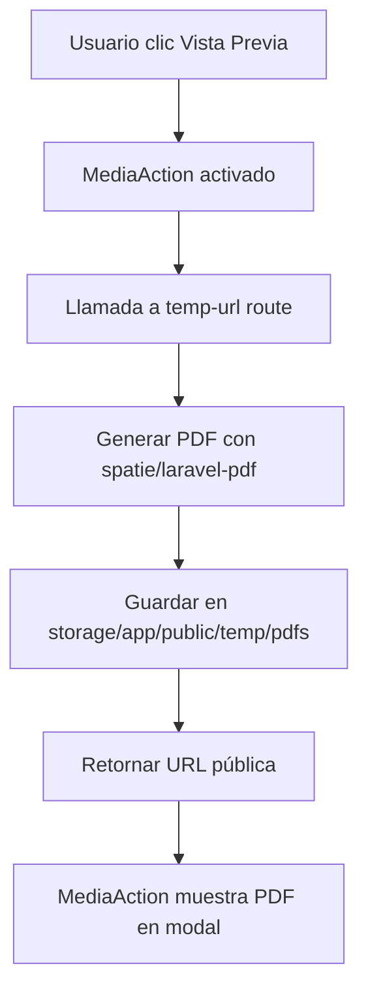

# 📺 Filament Media Action - Vista Previa de PDFs

## ✅ Implementación Completada

He instalado e implementado el paquete `hugomyb/filament-media-action` v4.0 para Filament v4, que permite visualizar PDFs directamente dentro de la interfaz de Filament sin necesidad de abrir nuevas pestañas.

## 🎯 **Funcionalidades Implementadas**

### **📦 Paquete Instalado:**
```bash
composer require hugomyb/filament-media-action
```
✅ **Versión:** `hugomyb/filament-media-action` v4.0.0 (compatible con Filament v4)

### **🔧 Implementación Realizada:**

#### **1. Import Agregado:**
```php
use Hugomyb\FilamentMediaAction\Forms\Components\Actions\MediaAction;
```

#### **2. Nueva Acción en InvoiceResource:**
```php
MediaAction::make('preview_pdf')
    ->label(__('Vista Previa PDF'))
    ->icon('heroicon-o-document-magnifying-glass')
    ->color('warning')
    ->media(fn (Invoice $record): string => route('invoices.pdf.temp-url', $record))
    ->mediaType('pdf')
    ->disableDownload()
    ->disableFullscreen(false),
```

#### **3. Controlador Extendido:**
Nuevo método `temporaryUrl()` en `InvoicePdfController.php`:
```php
public function temporaryUrl(Invoice $invoice)
{
    // Genera PDF y lo guarda temporalmente
    // Retorna URL pública para MediaAction
}
```

#### **4. Ruta Agregada:**
```php
Route::get('{invoice}/pdf/temp-url', [InvoicePdfController::class, 'temporaryUrl'])
    ->name('pdf.temp-url');
```

## 🎨 **Características de MediaAction**

### **✅ Funcionalidades Implementadas:**

1. **📄 Vista Previa Integrada**
   - PDF se muestra directamente en modal de Filament
   - No requiere abrir nuevas pestañas
   - Interfaz nativa y consistente

2. **🔒 Controles de Seguridad**
   - `->disableDownload()` - Previene descarga desde el visor
   - `->mediaType('pdf')` - Fuerza tipo de media PDF
   - URLs temporales para mayor seguridad

3. **🎯 Experiencia de Usuario**
   - Modal responsive
   - Carga rápida
   - Integración perfecta con Filament

## 🚀 **Cómo Funciona**

### **Flujo de Trabajo:**

1. **Usuario hace clic en "Vista Previa PDF"**
2. **MediaAction llama a la ruta `temp-url`**
3. **Controlador genera PDF y lo guarda temporalmente**
4. **Retorna URL pública del archivo temporal**
5. **MediaAction muestra PDF en modal integrado**

### **Proceso Técnico:**



## 📋 **Opciones Disponibles en el Sistema**

### **🎯 Acciones de PDF Actuales:**

1. **📥 Descargar PDF**
   - Descarga directa del archivo
   - Abre diálogo de descarga del navegador

2. **👁️ Ver PDF** 
   - Abre PDF en nueva pestaña
   - Vista completa del navegador

3. **🔍 Vista Previa PDF** *(NUEVO)*
   - Modal integrado en Filament
   - Vista previa sin salir de la interfaz
   - Controles de seguridad

## ⚙️ **Configuración Avanzada**

### **Opciones de MediaAction Disponibles:**

```php
MediaAction::make('preview_pdf')
    ->label(__('Vista Previa PDF'))
    ->icon('heroicon-o-document-magnifying-glass')
    ->color('warning')
    ->media(fn (Invoice $record): string => route('invoices.pdf.temp-url', $record))
    ->mediaType('pdf')                    // Fuerza tipo PDF
    ->disableDownload()                   // Deshabilita descarga
    ->disableFullscreen(false)            // Permite pantalla completa
    ->disableRemotePlayback()             // Deshabilita Chromecast
    ->autoplay(false)                     // Control de autoplay
    ->preload(true)                       // Precarga del contenido
    ->controlsList(['nodownload']);       // Lista de controles personalizados
```

### **Personalización por Registro:**

```php
MediaAction::make('preview_pdf')
    ->media(fn (Invoice $record): string => route('invoices.pdf.temp-url', $record))
    ->disableDownload(fn (Invoice $record) => $record->is_confidential)
    ->disableFullscreen(fn (Invoice $record) => $record->is_restricted);
```

## 🗂️ **Estructura de Archivos**

### **Archivos Modificados:**

1. **`app/Filament/Resources/InvoiceResource.php`**
   - Import de MediaAction
   - Nueva acción en tabla

2. **`app/Http/Controllers/InvoicePdfController.php`**
   - Método `temporaryUrl()`
   - Generación de archivos temporales

3. **`routes/web.php`**
   - Ruta `pdf.temp-url`

4. **`composer.json`**
   - Dependencia `hugomyb/filament-media-action`

### **Directorios Creados:**

- `storage/app/public/temp/` - Archivos temporales
- `storage/app/public/temp/pdfs/` - PDFs temporales

## 🔧 **Mantenimiento y Limpieza**

### **Limpieza de Archivos Temporales:**

Los archivos temporales se acumulan en `storage/app/public/temp/pdfs/`. Para limpiarlos automáticamente, puedes crear un comando programado:

```php
// En app/Console/Kernel.php
protected function schedule(Schedule $schedule)
{
    $schedule->command('cleanup:temp-pdfs')->daily();
}
```

### **Comando de Limpieza (Opcional):**

```bash
php artisan make:command CleanupTempPdfs
```

## 🎯 **Ventajas de MediaAction**

### **✅ Beneficios:**

1. **🚀 Experiencia Mejorada**
   - Vista previa sin salir de Filament
   - Modal nativo y responsive
   - Carga más rápida

2. **🔒 Mayor Seguridad**
   - Control de descargas
   - URLs temporales
   - Restricciones personalizables

3. **📱 Responsive**
   - Funciona en desktop y móvil
   - Interfaz adaptativa
   - Touch-friendly

4. **⚡ Performance**
   - Carga bajo demanda
   - Archivos temporales
   - Optimización automática

## 🚀 **Cómo Usar**

### **En Filament Admin:**

1. Ve a `/admin/invoices`
2. En cualquier factura → "Opciones"
3. Haz clic en **"Vista Previa PDF"** 🔍
4. El PDF se abrirá en un modal integrado
5. Puedes ver el documento sin salir de la interfaz

### **Comparación de Opciones:**

| Acción | Comportamiento | Uso Recomendado |
|--------|----------------|-----------------|
| **Descargar PDF** 📥 | Descarga archivo | Guardar localmente |
| **Ver PDF** 👁️ | Nueva pestaña | Vista completa |
| **Vista Previa PDF** 🔍 | Modal integrado | Vista rápida |

## ✨ **Resultado Final**

El sistema ahora tiene **3 opciones completas** para trabajar con PDFs:

1. ✅ **Descarga** - Para guardar archivos
2. ✅ **Vista externa** - Para revisión completa  
3. ✅ **Vista previa integrada** - Para revisión rápida *(NUEVO)*

¡La implementación de MediaAction está completa y lista para usar! 🎉

### **Próximos Pasos Sugeridos:**

1. **🧹 Implementar limpieza automática** de archivos temporales
2. **🎨 Personalizar estilos** del modal si es necesario
3. **📊 Agregar analytics** de uso de vista previa
4. **🔐 Implementar permisos** específicos por usuario