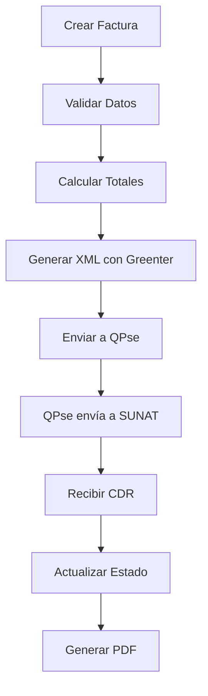
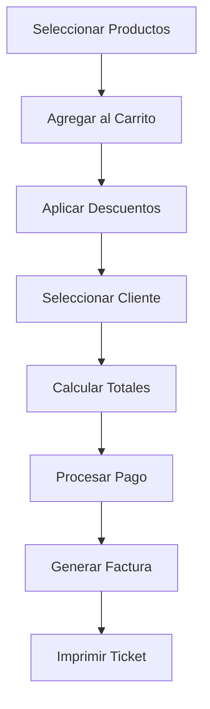
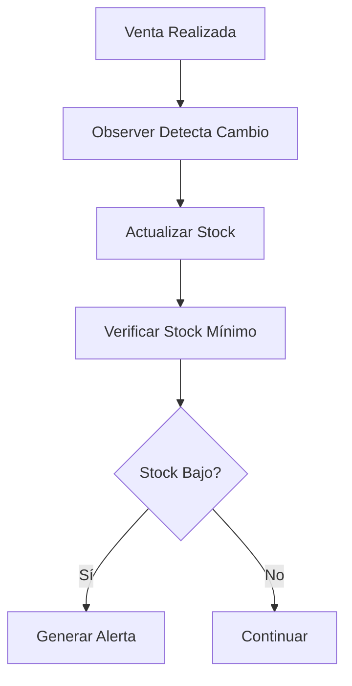

# Análisis Detallado del Sistema de Facturación

## Resumen Ejecutivo

Este documento presenta un análisis completo del sistema de facturación desarrollado en Laravel con Filament, que incluye integración con SUNAT para facturación electrónica, punto de venta (POS), gestión de inventarios y múltiples funcionalidades empresariales.

## Arquitectura General

### Stack Tecnológico
- **Backend**: Laravel (PHP)
- **Frontend Admin**: Filament (Panel de administración)
- **Base de Datos**: MySQL/PostgreSQL
- **Facturación Electrónica**: Integración con SUNAT vía QPse y Greenter
- **PDF**: Generación de facturas y tickets
- **API Externa**: Factiliza para consulta de DNI/RUC

### Estructura del Proyecto
```
app/
├── Filament/          # Interfaz administrativa
├── Models/            # Modelos Eloquent
├── Services/          # Lógica de negocio
├── Facades/           # Facades para servicios
├── Observers/         # Observadores de eventos
└── Providers/         # Proveedores de servicios
```

## Modelos y Entidades Principales

### 1. User (Usuario)
**Ubicación**: `app/Models/User.php`

**Funcionalidades**:
- Autenticación y autorización
- Relación con empresas (companies)
- Gestión de roles y permisos
- Configuración de perfil

**Relaciones**:
- `belongsToMany(Company::class)` - Múltiples empresas por usuario

### 2. Company (Empresa)
**Ubicación**: `app/Models/Company.php`

**Funcionalidades**:
- Datos fiscales de la empresa
- Configuración SUNAT
- Certificados digitales
- Configuración de facturación electrónica

**Campos Principales**:
- `ruc`: RUC de la empresa
- `business_name`: Razón social
- `trade_name`: Nombre comercial
- `address`: Dirección fiscal
- `sunat_user`, `sunat_password`: Credenciales SUNAT
- `certificate_path`: Ruta del certificado digital

**Relaciones**:
- `belongsToMany(User::class)` - Múltiples usuarios
- `hasMany(Invoice::class)` - Facturas de la empresa
- `hasMany(Product::class)` - Productos de la empresa
- `hasMany(Client::class)` - Clientes de la empresa

### 3. Invoice (Factura)
**Ubicación**: `app/Models/Invoice.php`

**Funcionalidades**:
- Gestión completa de facturas y boletas
- Integración con SUNAT
- Cálculos automáticos de impuestos
- Estados de facturación electrónica
- Generación de cuotas para crédito

**Campos Principales**:
- `company_id`: Empresa emisora
- `document_type`: Tipo de documento (01=Factura, 03=Boleta)
- `series`, `number`: Serie y número
- `issue_date`: Fecha de emisión
- `currency`: Moneda (PEN, USD)
- `operation_type`: Tipo de operación
- `subtotal`, `igv_amount`, `total`: Montos
- `sunat_status`: Estado en SUNAT
- `xml_path`, `cdr_path`: Rutas de archivos XML

**Relaciones**:
- `belongsTo(Company::class)` - Empresa emisora
- `belongsTo(Client::class)` - Cliente
- `belongsTo(DocumentSeries::class)` - Serie del documento
- `hasMany(InvoiceDetail::class)` - Detalles de la factura
- `hasMany(PaymentInstallment::class)` - Cuotas de pago

**Scopes**:
- `pending()`: Facturas pendientes
- `sent()`: Facturas enviadas a SUNAT
- `accepted()`: Facturas aceptadas por SUNAT

### 4. InvoiceDetail (Detalle de Factura)
**Ubicación**: `app/Models/InvoiceDetail.php`

**Funcionalidades**:
- Líneas de detalle de facturas
- Cálculos automáticos por línea
- Gestión de descuentos
- Control de inventario

**Campos Principales**:
- `invoice_id`: Factura padre
- `product_id`: Producto
- `quantity`: Cantidad
- `unit_price`: Precio unitario
- `discount_amount`: Descuento
- `subtotal`, `igv_amount`, `total`: Montos calculados

### 5. Product (Producto)
**Ubicación**: `app/Models/Product.php`

**Funcionalidades**:
- Catálogo de productos y servicios
- Gestión de inventario
- Clasificación SUNAT
- Control de stock
- Categorización

**Campos Principales**:
- `company_id`: Empresa propietaria
- `code`: Código interno
- `name`: Nombre del producto
- `sunat_code`: Código SUNAT
- `unit_measure`: Unidad de medida
- `sale_price`: Precio de venta
- `purchase_price`: Precio de compra
- `stock`: Stock actual
- `min_stock`: Stock mínimo
- `igv_type`: Tipo de IGV
- `category_id`, `brand_id`: Categoría y marca

**Relaciones**:
- `belongsTo(Company::class)` - Empresa
- `belongsTo(Category::class)` - Categoría
- `belongsTo(Brand::class)` - Marca
- `hasMany(InvoiceDetail::class)` - Detalles de factura

**Scopes**:
- `active()`: Productos activos
- `lowStock()`: Productos con stock bajo

### 6. Client (Cliente)
**Ubicación**: `app/Models/Client.php`

**Funcionalidades**:
- Gestión de clientes
- Datos fiscales y comerciales
- Historial de compras
- Segmentación comercial

**Campos Principales**:
- `company_id`: Empresa propietaria
- `document_type`: Tipo de documento (DNI, RUC)
- `document_number`: Número de documento
- `name`: Nombre/Razón social
- `email`, `phone`: Contacto
- `address`: Dirección
- `credit_limit`: Límite de crédito
- `payment_condition`: Condición de pago

**Relaciones**:
- `belongsTo(Company::class)` - Empresa
- `hasMany(Invoice::class)` - Facturas del cliente

### 7. Category y Brand (Categoría y Marca)
**Ubicación**: `app/Models/Category.php`, `app/Models/Brand.php`

**Funcionalidades**:
- Organización del catálogo
- Jerarquía de categorías
- Filtros y búsquedas

### 8. DocumentSeries (Series de Documentos)
**Ubicación**: `app/Models/DocumentSeries.php`

**Funcionalidades**:
- Control de numeración
- Series por tipo de documento
- Numeración automática

**Campos Principales**:
- `company_id`: Empresa
- `document_type`: Tipo de documento
- `series`: Serie (F001, B001, etc.)
- `current_number`: Número actual
- `is_active`: Estado activo

### 9. ExchangeRate (Tipo de Cambio)
**Ubicación**: `app/Models/ExchangeRate.php`

**Funcionalidades**:
- Gestión de tipos de cambio
- Conversión de monedas
- Histórico de cambios

**Métodos Principales**:
- `getByDate($date)`: Obtener tipo de cambio por fecha
- `getLatest()`: Obtener último tipo de cambio

### 10. PaymentInstallment (Cuotas de Pago)
**Ubicación**: `app/Models/PaymentInstallment.php`

**Funcionalidades**:
- Gestión de cuotas para ventas a crédito
- Control de vencimientos
- Estados de pago

**Campos Principales**:
- `invoice_id`: Factura asociada
- `installment_number`: Número de cuota
- `due_date`: Fecha de vencimiento
- `amount`: Monto de la cuota
- `status`: Estado (pending, paid, overdue)

**Scopes**:
- `pending()`: Cuotas pendientes
- `overdue()`: Cuotas vencidas

## Servicios y Lógica de Negocio

### 1. QpseService
**Ubicación**: `app/Services/QpseService.php`

**Funcionalidades**:
- Integración con QPse para facturación electrónica
- Gestión de empresas en QPse
- Envío de documentos a SUNAT
- Obtención de tokens de autenticación

**Métodos Principales**:
- `crearEmpresa($companyData)`: Crear empresa en QPse
- `obtenerToken()`: Obtener token de autenticación
- `setCredenciales($usuario, $password)`: Configurar credenciales

### 2. ElectronicInvoiceService
**Ubicación**: `app/Services/ElectronicInvoiceService.php`

**Funcionalidades**:
- Orquestación del proceso de facturación electrónica
- Envío de diferentes tipos de documentos
- Procesamiento de respuestas SUNAT

**Métodos Principales**:
- `sendInvoice($invoice)`: Enviar factura
- `sendCreditNote($creditNote)`: Enviar nota de crédito
- `sendDebitNote($debitNote)`: Enviar nota de débito
- `processElectronicDocument($document)`: Procesar documento electrónico

### 3. FactilizaService
**Ubicación**: `app/Services/FactilizaService.php`

**Funcionalidades**:
- Consulta de DNI y RUC
- Validación de documentos de identidad
- Obtención de datos de RENIEC y SUNAT

**Métodos Principales**:
- `consultarDni($dni)`: Consultar datos por DNI
- `consultarRuc($ruc)`: Consultar datos por RUC

### 4. QpseGreenterAdapter
**Ubicación**: `app/Services/QpseGreenterAdapter.php`

**Funcionalidades**:
- Adaptador entre Greenter y QPse
- Generación de XML con Greenter
- Envío a QPse para procesamiento SUNAT

**Métodos Principales**:
- `sendInvoice($invoice)`: Enviar factura
- `sendCreditNote($creditNote)`: Enviar nota de crédito
- `processDocument($document, $type)`: Procesar documento

### 5. GreenterXmlService
**Ubicación**: `app/Services/GreenterXmlService.php`

**Funcionalidades**:
- Generación de XML usando Greenter
- Configuración de certificados
- Creación de estructuras XML SUNAT

**Métodos Principales**:
- `configureFactory($company)`: Configurar factory de Greenter
- `getCompany($companyModel)`: Obtener datos de empresa
- `generateInvoiceXml($invoice)`: Generar XML de factura

### 6. CompanyApiService
**Ubicación**: `app/Services/CompanyApiService.php`

**Funcionalidades**:
- Consulta de RUC usando API de Factiliza
- Cache de consultas
- Validación de datos empresariales

**Métodos Principales**:
- `consultRuc($ruc)`: Consultar RUC
- Implementa cache y manejo de errores

## Facades

### 1. Qpse Facade
**Ubicación**: `app/Facades/Qpse.php`

**Métodos Expuestos**:
- `crearEmpresa()`
- `obtenerToken()`
- `setCredenciales()`

### 2. QpseGreenter Facade
**Ubicación**: `app/Facades/QpseGreenter.php`

**Métodos Expuestos**:
- `sendInvoice()`
- `sendCreditNote()`
- `sendDebitNote()`
- `isConfigured()`

## Interfaz Administrativa (Filament)

### Recursos Principales

#### 1. InvoiceResource
**Ubicación**: `app/Filament/Resources/InvoiceResource.php`

**Funcionalidades**:
- CRUD completo de facturas
- Formularios con validación
- Tablas con filtros y búsqueda
- Acciones personalizadas (enviar a SUNAT, generar PDF)

**Secciones del Formulario**:
- Datos Básicos: Empresa, serie, cliente, fechas
- Detalles: Líneas de productos
- Totales: Cálculos automáticos
- SUNAT: Estado y archivos

#### 2. ProductResource
**Ubicación**: `app/Filament/Resources/ProductResource.php`

**Funcionalidades**:
- Gestión de catálogo de productos
- Control de inventario
- Categorización y marcas
- Precios y costos

**Secciones del Formulario**:
- Información Básica: Código, nombre, descripción
- Clasificación: Categoría, marca, tipo SUNAT
- Precios: Venta, compra, márgenes
- Inventario: Stock, mínimos, ubicación

#### 3. ClientResource
**Ubicación**: `app/Filament/Resources/ClientResource.php`

**Funcionalidades**:
- Gestión de clientes
- Datos fiscales y comerciales
- Historial de transacciones
- Límites de crédito

#### 4. CompanyResource
**Ubicación**: `app/Filament/Resources/CompanyResource.php`

**Funcionalidades**:
- Configuración de empresas
- Datos fiscales
- Certificados SUNAT
- Configuración de facturación electrónica

### Páginas Especiales

#### 1. POS (Punto de Venta)
**Ubicación**: `app/Filament/Pages/Pos.php`

**Funcionalidades**:
- Interfaz de punto de venta
- Carrito de compras
- Cálculo de totales
- Descuentos y promociones
- Múltiples formas de pago
- Impresión de tickets

**Propiedades Principales**:
- `$cart`: Carrito de productos
- `$selectedClient`: Cliente seleccionado
- `$discountType`: Tipo de descuento
- `$discountValue`: Valor del descuento
- `$subtotal`, `$igv`, `$total`: Totales calculados

**Métodos Principales**:
- `addToCart()`: Agregar producto al carrito
- `removeFromCart()`: Remover producto
- `updateQuantity()`: Actualizar cantidad
- `applyDiscount()`: Aplicar descuento
- `processPayment()`: Procesar pago

### Widgets

#### 1. PosStatsOverview
**Ubicación**: `app/Filament/Widgets/PosStatsOverview.php`

**Funcionalidades**:
- Estadísticas del punto de venta
- Ventas del día
- Tickets promedio
- Productos con stock bajo
- Ventas semanales

**Métricas**:
- `getTodaySales()`: Ventas de hoy
- `getTodayTickets()`: Tickets de hoy
- `getAverageTicket()`: Ticket promedio
- `getWeeklySales()`: Ventas semanales
- `getLowStockProducts()`: Productos con stock bajo

## Observers (Observadores)

### 1. InvoiceObserver
**Ubicación**: `app/Observers/InvoiceObserver.php`

**Funcionalidades**:
- Cálculo automático de totales
- Generación de cuotas para crédito
- Actualización de numeración
- Prevención de recursión en eventos

**Eventos Manejados**:
- `creating()`: Antes de crear factura
- `created()`: Después de crear factura
- `updating()`: Antes de actualizar
- `updated()`: Después de actualizar

**Métodos Principales**:
- `calculateTotals()`: Calcular totales de la factura
- `generateInstallments()`: Generar cuotas de pago
- `updateSeries()`: Actualizar numeración de serie

### 2. InvoiceDetailObserver
**Ubicación**: `app/Observers/InvoiceDetailObserver.php`

**Funcionalidades**:
- Recálculo de totales al modificar detalles
- Actualización de inventario
- Validaciones de stock

**Eventos Manejados**:
- `saved()`: Después de guardar detalle
- `deleted()`: Después de eliminar detalle

## Providers (Proveedores)

### 1. QpseServiceProvider
**Ubicación**: `app/Providers/QpseServiceProvider.php`

**Funcionalidades**:
- Registro de servicios QPse
- Configuración de bindings
- Registro de facades
- Publicación de configuraciones

**Servicios Registrados**:
- `QpseService`
- `GreenterXmlService`
- `QpseGreenterAdapter`

**Aliases**:
- `'qpse' => QpseService::class`
- `'qpse.greenter' => QpseGreenterAdapter::class`

## Estructura de Base de Datos

### Tablas Principales

#### 1. companies
**Campos Principales**:
- `id`, `ruc`, `business_name`, `trade_name`
- `address`, `phone`, `email`
- `sunat_user`, `sunat_password`
- `certificate_path`, `certificate_password`
- `is_active`, `created_at`, `updated_at`

#### 2. invoices
**Campos Principales**:
- `id`, `company_id`, `client_id`, `document_series_id`
- `document_type`, `series`, `number`, `full_number`
- `issue_date`, `due_date`, `currency`
- `exchange_rate`, `operation_type`
- `subtotal`, `discount_amount`, `igv_amount`, `total`
- `sunat_status`, `xml_path`, `cdr_path`
- `notes`, `created_at`, `updated_at`

#### 3. invoice_details
**Campos Principales**:
- `id`, `invoice_id`, `product_id`
- `quantity`, `unit_price`, `discount_amount`
- `subtotal`, `igv_amount`, `total`
- `created_at`, `updated_at`

#### 4. products
**Campos Principales**:
- `id`, `company_id`, `category_id`, `brand_id`
- `code`, `name`, `description`
- `sunat_code`, `unit_measure`
- `sale_price`, `purchase_price`
- `stock`, `min_stock`, `max_stock`
- `igv_type`, `is_active`
- `created_at`, `updated_at`

#### 5. clients
**Campos Principales**:
- `id`, `company_id`
- `document_type`, `document_number`
- `name`, `email`, `phone`
- `address`, `district`, `province`, `department`
- `credit_limit`, `payment_condition`
- `is_active`, `created_at`, `updated_at`

### Relaciones de Base de Datos

```sql
-- Relaciones principales
companies -> invoices (1:N)
companies -> products (1:N)
companies -> clients (1:N)
companies -> document_series (1:N)

invoices -> invoice_details (1:N)
invoices -> payment_installments (1:N)
invoices -> clients (N:1)
invoices -> document_series (N:1)

products -> invoice_details (1:N)
products -> categories (N:1)
products -> brands (N:1)

users <-> companies (N:M)
```

## Vistas y Componentes Frontend

### 1. Vista POS
**Ubicación**: `resources/views/filament/pages/pos.blade.php`

**Características**:
- Interfaz moderna y responsiva
- Soporte para tema claro/oscuro
- Diseño tipo Apple con bordes redondeados
- Sidebar para carrito de compras
- Área principal para catálogo de productos
- Cálculos en tiempo real
- Integración con impresoras térmicas

**Secciones**:
- **Sidebar**: Carrito, cliente, totales, pago
- **Main Area**: Búsqueda, categorías, productos
- **Footer**: Acciones rápidas

### 2. Plantillas PDF

#### Factura A4
**Ubicación**: `resources/views/pdf/invoice.blade.php`

**Características**:
- Formato A4 estándar
- Cumple normativas SUNAT
- Encabezado con datos de empresa
- Información del cliente
- Tabla de productos detallada
- Totales y observaciones
- Códigos QR y hash

#### Ticket 80mm
**Ubicación**: `resources/views/pdf/ticket-80mm.blade.php`

**Características**:
- Formato para impresoras térmicas
- Ancho 80mm optimizado
- Fuente monoespaciada
- Información compacta
- Ideal para punto de venta

### 3. Modales de Filament

#### Detalles de Producto
**Ubicación**: `resources/views/filament/modals/product-details.blade.php`

**Funcionalidades**:
- Vista detallada de productos
- Información completa
- Imágenes y especificaciones

## Flujos de Trabajo Principales

### 1. Proceso de Facturación Electrónica



### 2. Flujo del Punto de Venta



### 3. Gestión de Inventario



## Integraciones Externas

### 1. SUNAT (Facturación Electrónica)
- **Proveedor**: QPse
- **Protocolo**: REST API
- **Formatos**: XML UBL 2.1
- **Certificados**: Requeridos para producción

### 2. Consulta de Documentos
- **Proveedor**: Factiliza
- **Servicios**: DNI, RUC
- **Protocolo**: REST API
- **Cache**: Implementado para optimización

### 3. Generación XML
- **Librería**: Greenter
- **Estándar**: UBL 2.1
- **Validación**: Esquemas XSD SUNAT

## Configuración y Despliegue

### Variables de Entorno Requeridas
```env
# Base de datos
DB_CONNECTION=mysql
DB_HOST=127.0.0.1
DB_PORT=3306
DB_DATABASE=facturacion
DB_USERNAME=root
DB_PASSWORD=

# QPse
QPSE_BASE_URL=https://api.qpse.pe
QPSE_USERNAME=
QPSE_PASSWORD=

# Factiliza
FACTILIZA_TOKEN=
FACTILIZA_BASE_URL=https://api.factiliza.com

# Certificados
CERTIFICATE_PATH=storage/certificates/
```

### Comandos de Instalación
```bash
# Instalar dependencias
composer install
npm install

# Configurar base de datos
php artisan migrate
php artisan db:seed

# Generar claves
php artisan key:generate

# Crear usuario admin
php artisan make:filament-user

# Compilar assets
npm run build
```

## Funcionalidades Destacadas

### 1. Facturación Electrónica Completa
- ✅ Facturas (01)
- ✅ Boletas (03)
- ✅ Notas de Crédito (07)
- ✅ Notas de Débito (08)
- ✅ Integración SUNAT
- ✅ Validación en tiempo real

### 2. Punto de Venta Moderno
- ✅ Interfaz intuitiva
- ✅ Búsqueda rápida de productos
- ✅ Múltiples formas de pago
- ✅ Descuentos y promociones
- ✅ Impresión de tickets
- ✅ Modo offline básico

### 3. Gestión de Inventario
- ✅ Control de stock en tiempo real
- ✅ Alertas de stock mínimo
- ✅ Categorización avanzada
- ✅ Códigos de barras
- ✅ Múltiples unidades de medida
- ✅ Precios por cliente

### 4. Reportes y Analytics
- ✅ Dashboard ejecutivo
- ✅ Reportes de ventas
- ✅ Análisis de productos
- ✅ Estadísticas de clientes
- ✅ Exportación a Excel/PDF

### 5. Multi-empresa
- ✅ Gestión de múltiples empresas
- ✅ Usuarios compartidos
- ✅ Configuración independiente
- ✅ Reportes consolidados

## Consideraciones de Seguridad

### 1. Autenticación y Autorización
- Autenticación basada en sesiones
- Roles y permisos granulares
- Protección CSRF
- Validación de entrada

### 2. Datos Sensibles
- Certificados digitales encriptados
- Credenciales SUNAT protegidas
- Logs de auditoría
- Backup automático

### 3. Comunicaciones
- HTTPS obligatorio en producción
- Validación SSL para APIs
- Tokens de acceso seguros
- Rate limiting implementado

## Mantenimiento y Monitoreo

### 1. Logs del Sistema
- Laravel Log: `storage/logs/laravel.log`
- SUNAT Log: Eventos de facturación
- Error Log: Errores de aplicación
- Access Log: Accesos de usuarios

### 2. Tareas Programadas
- Backup de base de datos
- Limpieza de archivos temporales
- Sincronización de tipos de cambio
- Reportes automáticos

### 3. Métricas de Rendimiento
- Tiempo de respuesta de APIs
- Uso de memoria y CPU
- Espacio en disco
- Conexiones de base de datos

## Conclusiones

El sistema de facturación analizado es una solución completa y robusta que cumple con los requerimientos de facturación electrónica en Perú. Sus principales fortalezas son:

1. **Arquitectura Sólida**: Basada en Laravel con buenas prácticas
2. **Integración SUNAT**: Completa y confiable
3. **Interfaz Moderna**: Filament proporciona una UI excelente
4. **Escalabilidad**: Diseño multi-empresa
5. **Funcionalidad Completa**: POS, inventario, reportes

### Áreas de Mejora Identificadas

1. **Testing**: Implementar pruebas automatizadas
2. **API REST**: Desarrollar API para integraciones
3. **Mobile App**: Aplicación móvil para vendedores
4. **BI Avanzado**: Dashboard más analítico
5. **Integración Bancaria**: Pagos electrónicos

### Recomendaciones Técnicas

1. Implementar Redis para cache
2. Configurar queues para procesos pesados
3. Optimizar consultas de base de datos
4. Implementar CDN para assets
5. Configurar monitoring con Sentry

Este análisis proporciona una visión completa del sistema, facilitando el mantenimiento, desarrollo de nuevas funcionalidades y onboarding de nuevos desarrolladores.